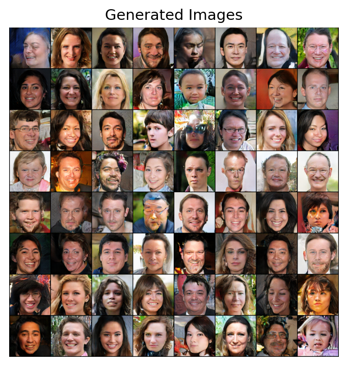
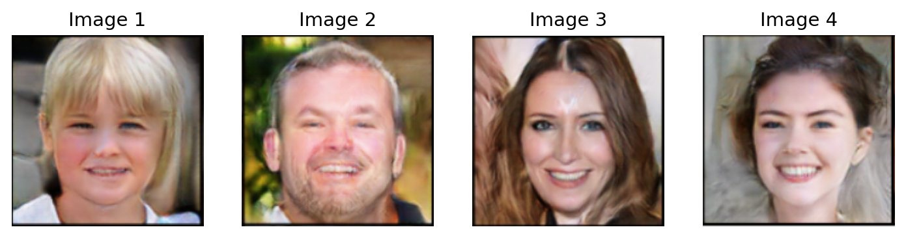

# Face Generation with an Enhanced DC-GAN Model
This is a PyTorch implementation of a variation of DCGAN improved with three methods;
instance noise, minibatch standard deviation, and weight normalisation.
The model was trained on the FFHQ 128 dataset, and used to generate
fake faces. Relatively good results were achieved, but they suffered from
the common issue encountered with GANs of mode collapse.

## Results
The model was run for 50 epochs, taking 5 hours and 44 minutes to train on an NVIDIA GeForce RTX 3060Ti. Faces generated
are of reasonable quality and are recognisably close to real human faces. The images are
relatively sharp and free of blurring, but fail to appear realistic to the human eye. The
diversity of the images is fair:

And here are some cherry-picked samples that show the best outputs the model has generated:

